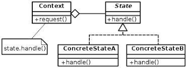
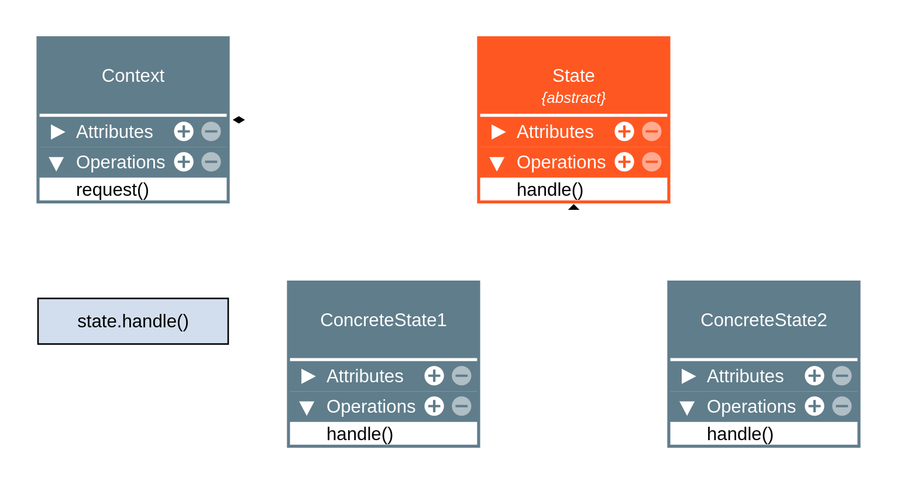

 

# State Pattern

Project is example use state pattern describe work, objective is learn.

## 🔧 System E-commerce with functions: approve payment, reject payment, ship order. 

## About State Pattern

From Wikipedia, the free encyclopedia

Jump to navigationJump to search
The state pattern is a behavioral software design pattern that allows an object to alter its behavior when its internal state changes. This pattern is close to the concept of finite-state machines. The state pattern can be interpreted as a strategy pattern, which is able to switch a strategy through invocations of methods defined in the pattern's interface.

The state pattern is used in computer programming to encapsulate varying behavior for the same object, based on its internal state. This can be a cleaner way for an object to change its behavior at runtime without resorting to conditional statements and thus improve maintainability.[1]: 395 

## Overview
From Wikipedia, the free encyclopedia

The state design pattern is one of twenty-three design patterns documented by the Gang of Four that describe how to solve recurring design problems. Such problems cover the design of flexible and reusable object-oriented software, such as objects that are easy to implement, change, test, and reuse.[3]

The state pattern is set to solve two main problems:[4]

An object should change its behavior when its internal state changes.
State-specific behavior should be defined independently. That is, adding new states should not affect the behavior of existing states.
Implementing state-specific behavior directly within a class is inflexible because it commits the class to a particular behavior and makes it impossible to add a new state or change the behavior of an existing state later, independently from the class, without changing the class. In this, the pattern describes two solutions:

Define separate (state) objects that encapsulate state-specific behavior for each state. That is, define an interface (state) for performing state-specific behavior, and define classes that implement the interface for each state.
A class delegates state-specific behavior to its current state object instead of implementing state-specific behavior directly.
This makes a class independent of how state-specific behavior is implemented. New states can be added by defining new state classes. A class can change its behavior at run-time by changing its current state object.

## Diagram State Pattern

# About Project

The user  expects to see the following state transitions when using the ecommerce program:

1 - Startup in the initial state OrderPending.
2 - Moving from the initial state into the paymentApprove.
3 - Moving from the purchase state into the paymentReject.
4 - Moving from the ship.

